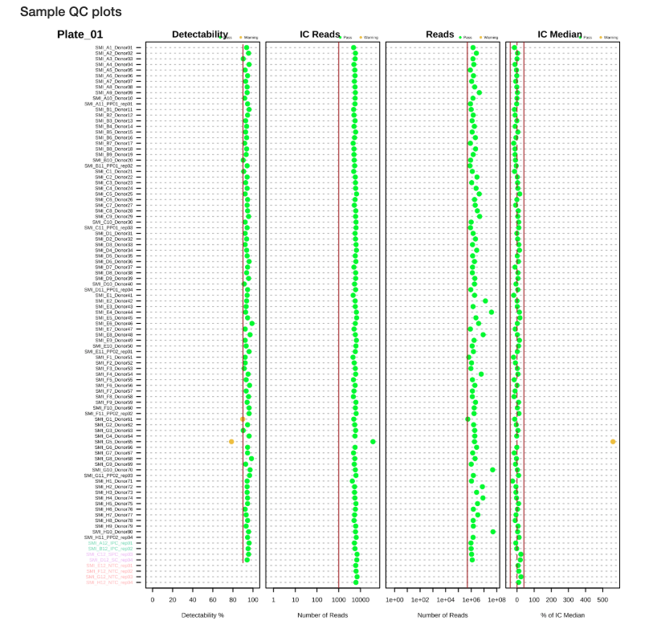

# Quality Control

Quality control is essential before proceeding with statistical analysis. This chapter covers generating QC reports and interpreting quality control metrics at the plate, run, sample, and target levels.

## Why Quality Control Matters

Quality control helps identify:

- Technical issues with sample processing
- Outlier samples
- Problems with specific protein targets
- Batch effects
- Overall data quality and reliability

**Always perform QC before analysis!** Problems caught early save time and ensure valid results.

## Automated QC Report {#qc-report}

NULISAseqR includes a built-in QC report template that generates comprehensive quality metrics across multiple levels: plate/run, sample, and target.

```{r qc_report, eval=FALSE}
# Specify output directory
out_dir <- tempdir()  # Or use your preferred directory

## See Chapter 1 for loading data
#
# data_dir <- system.file("extdata", package = "NULISAseqR")
# 
# xml_files <- file.path(
#   data_dir,
#   c("INF_Panel_V1_detectability_study_plate01.xml",
#     "INF_Panel_V1_detectability_study_plate02.xml")
# )

render_QC_report(
  output_filename = "Detectability_Study_NULISAseq_QC_report.html",
  output_dir = out_dir,
  study_name = "NULISAseq QC Report - Detectability Study",
  assayName = "Inflammation Panel 250",
  dataDir = dataDir,
  xml_files = basename(xml_files),
  report_type = "webApp"
)

# View the report
browseURL(file.path(out_dir, "Detectability_Study_NULISAseq_QC_report.html"))
```

## QC Report Structure {#qc-report-structure}

The automated QC report is organized into several key sections:

### Plate Layout
Visual representation of sample placement on 96-well plates showing:
 
 
- Sample positions and identifiers
- Control sample locations (NC, IPC, SC)
- Plate ID assignment and verification

### Run Summary
The report provides detailed summaries for overall run summary and each type of control samples:
 

#### Interal Controls (IC)
An exogenous reporter protein added to each well for well to well normalization and assessing the uniformity of the assay run.
 
 
#### Inter-Plate Controls (IPC)
Independent pooled plasma controls used for normalization between plates and precision assessment.
 

#### Sample Controls (SC)
Pooled plasma source different from IPCs, used to assess run suitability and overall intra-plate and inter-plate CV. 

 
#### Negative Controls (NC)
Assay buffer used to determine Limit of Detection (LOD) for each target for each plate and assess overall assay performance.

 
### Quality Control Metrics {-}

The QC report evaluates quality at three hierarchical levels:

- **Plate/Run QC**
- **Sample QC**
- **Target Detectability**

### Plate/Run QC

Plate-level QC metrics assess the overall quality of each assay run. These are evaluated on both unnormalized (raw) and IPC-normalized data.


Plate-level QC metrics assess the overall quality of each assay run. These are evaluated on both unnormalized (raw) and IPC-normalized data.

#### Key Plate QC Criteria {-}

##### 1. IC CV (Internal Control Coefficient of Variation) {-}
- **Definition**: CV of internal control Parseable Matching reads across all wells
- **Threshold**: Maximum `r paste0(NULISAseqR:::MAX_IC_CV * 100, "%")` 
- **Purpose**: Assesses technical variability within a plate
- **Interpretation**: 
  - ✓ CV < `r paste0(NULISAseqR:::MAX_IC_CV * 100, "%")`: Good technical reproducibility
  - ✗ CV ≥ `r paste0(NULISAseqR:::MAX_IC_CV * 100, "%")`: High technical variation, investigate plate processing

##### 2. IPC CV (Inter-Plate Control CV) {-}
- **Definition**: CV of Parseable Matching reads across all IPC samples
- **Threshold**: Maximum `r paste0(NULISAseqR:::MAX_IPC_CV * 100, "%")`
- **Purpose**: Evaluates consistency of control samples
- **Interpretation**:
  - ✓ CV < `r paste0(NULISAseqR:::MAX_IPC_CV * 100, "%")`: IPCs performing consistently
  - ✗ CV ≥ `r paste0(NULISAseqR:::MAX_IPC_CV * 100, "%")`: IPC variability too high, may affect normalization

##### 3. IPC Target CV {-}
- **Definition**: Median CV of all IPC targets across replicates
- **Threshold**: Maximum `r paste0(NULISAseqR:::MAX_MEDIAN_IPC_TARGET_CV * 100, "%")`
- **Purpose**: Assesses reproducibility at the protein target level
- **Interpretation**:
  - ✓ Median CV < `r paste0(NULISAseqR:::MAX_MEDIAN_IPC_TARGET_CV * 100, "%")`: Excellent target-level precision
  - ✗ Median CV ≥ `r paste0(NULISAseqR:::MAX_MEDIAN_IPC_TARGET_CV * 100, "%")`: Some targets showing poor reproducibility

##### 4. Run Detectability {-}
- **Definition**: Percentage of targets that are detectable (> 50% of samples above LOD)
- **Threshold**: Minimum `r paste0(NULISAseqR:::DETECTABILITY_FRAC * 100, "%")`
- **Purpose**: Overall assessment of assay sensitivity
- **Interpretation**:
  - ✓ Detectability ≥ `r paste0(NULISAseqR:::DETECTABILITY_FRAC * 100, "%")`: Most targets detecting well
  - ✗ Detectability < `r paste0(NULISAseqR:::DETECTABILITY_FRAC * 100, "%")`: Poor overall detection, check sample quality or assay conditions

#### 5. Reads (Total Parseable Matching Reads) {-}
- **Definition**: Minimum number of reads required per plate
- **Threshold**: Minimum `r format(NULISAseqR:::MIN_READS, big.mark = ",", scientific = FALSE)` reads
- **Purpose**: Ensures sufficient sequencing depth
- **Interpretation**:
  - ✓ Reads ≥ `r paste0(NULISAseqR:::MIN_READS / 1e6, "M")`: Adequate sequencing coverage
  - ✗ Reads < `r paste0(NULISAseqR:::MIN_READS / 1e6, "M")`: Insufficient depth, may need re-sequencing

### Sample QC

Sample-level QC identifies individual samples that may have quality issues.


#### Key Sample QC Criteria {- #key-sample-qc-criteria}

##### 1. Sample Detectability {- #sample-detectability}
- **Definition**: Percentage of targets with reads above LOD for each sample
- **Thresholds** (vary by sample type):
  - Plasma: Minimum `r paste0(NULISAseqR:::MIN_FRAC_DETECTABILITY_TAP["plasma"] * 100, "%")` 
  - Serum: Minimum `r paste0(NULISAseqR:::MIN_FRAC_DETECTABILITY_TAP["serum"] * 100, "%")`
  - CSF: Minimum `r paste0(NULISAseqR:::MIN_FRAC_DETECTABILITY_TAP["csf"] * 100, "%")`
  - Urine: Minimum `r paste0(NULISAseqR:::MIN_FRAC_DETECTABILITY_TAP["urine"] * 100, "%")`
  - Cell culture: Minimum `r paste0(NULISAseqR:::MIN_FRAC_DETECTABILITY_TAP["cell_culture"] * 100, "%")`
  - NHP plasma: Minimum `r paste0(NULISAseqR:::MIN_FRAC_DETECTABILITY_TAP["nhp_plasma"] * 100, "%")`
  - NHP serum: Minimum `r paste0(NULISAseqR:::MIN_FRAC_DETECTABILITY_TAP["nhp_serum"] * 100, "%")`
  - NHP CSF: Minimum `r paste0(NULISAseqR:::MIN_FRAC_DETECTABILITY_TAP["nhp_csf"] * 100, "%")`
  - Dried blood spot: Minimum `r paste0(NULISAseqR:::MIN_FRAC_DETECTABILITY_TAP["dried_blood_spot"] * 100, "%")`
  - Control: Minimum `r paste0(NULISAseqR:::MIN_FRAC_DETECTABILITY_TAP["control"] * 100, "%")`
  - Other: Minimum `r paste0(NULISAseqR:::MIN_FRAC_DETECTABILITY_TAP["other"] * 100, "%")`
- **Purpose**: Identifies samples with low overall protein detection
- **Interpretation**:
  - ✓ Detectability above threshold: Sample has adequate protein levels
  - ✗ Detectability below threshold: Sample may be degraded, diluted, or have insufficient protein

##### 2. IC Median (Internal Control Median) {-}
- **Definition**: Sample IC reads relative to the plate median
- **Threshold**: Within `r paste0("±", as.numeric(strsplit(NULISAseqR:::MIN_IC_MEDIAN, ",")[[1]][2]) * 100, "%")` of plate median
- **Purpose**: Identifies samples with abnormal internal control performance
- **Interpretation**:
  - ✓ IC Median within `r paste0("±", as.numeric(strsplit(NULISAseqR:::MIN_IC_MEDIAN, ",")[[1]][2]) * 100, "%")`: Sample processed normally
  - ✗ IC Median outside `r paste0("±", as.numeric(strsplit(NULISAseqR:::MIN_IC_MEDIAN, ",")[[1]][2]) * 100, "%")`: Potential pipetting error, reagent issue, or sample quality problem

##### 3. IC Reads per Sample {-}
- **Definition**: Minimum number of reads required per sample for internal control
- **Threshold**: Minimum `r paste0(NULISAseqR:::MIN_IC_READS_PER_SAMPLE)` reads
- **Purpose**: Ensures adequate internal control signal
- **Interpretation**:
  - ✓ Reads ≥ `r paste0(NULISAseqR:::MIN_IC_READS_PER_SAMPLE)`: Sample has adequate IC signal
  - ✗ Reads < `r paste0(NULISAseqR:::MIN_IC_READS_PER_SAMPLE)`: Sample has insufficient IC signal, may affect normalization

##### 4. Total Reads per Sample {-}
- **Definition**: inimum number of reads required per sample
- **Threshold**: Minimum `r format(NULISAseqR:::MIN_NUM_READS_PER_SAMPLE, big.mark = ",", scientific = FALSE)` reads
- **Purpose**: Ensures sufficient sequencing depth per sample
- **Interpretation**:
  - ✓ Reads ≥ `r paste0(NULISAseqR:::MIN_NUM_READS_PER_SAMPLE / 1e3, "K")`: Sample has adequate sequencing coverage 
  - ✗ Reads < `r paste0(NULISAseqR:::MIN_NUM_READS_PER_SAMPLE / 1e3, "K")`: Sample has low signal, may need re-sequencing

The QC report includes several plots for sample assessment:

- **Detectability Plot**: Shows the percentage of targets detected for each sample (Figures \@ref(fig:sample-qc-plot-plate1) and \@ref(fig:sample-qc-plot-plate2))
- **IC Median Plot**: Displays internal control performance relative to plate median (Figures \@ref(fig:sample-qc-plot-plate1) and \@ref(fig:sample-qc-plot-plate2))
- **Reads Distribution**: Shows the distribution of total reads across samples (Figures \@ref(fig:sample-qc-plot-plate1) and \@ref(fig:sample-qc-plot-plate2))
- **Sample Boxplots**: Display normalized expression distributions for each sample (Figures \@ref(fig:sample-boxplot-plate1) and \@ref(fig:sample-boxplot-plate2))

These visualizations help identify:

- Samples with low protein detection
- Samples with abnormal internal control performance
- Outlier samples requiring further investigation
- Overall quality and consistency within and between plates


**Sample QC Plots**:

```{r sample-qc-plot-plate1, echo=FALSE, fig.cap="Sample QC plots for Plate 1", out.width="100%", out.extra='style="max-width:800px;"'}

```

```{r sample-qc-plot-plate2, echo=FALSE, fig.cap="Sample QC plots for Plate 2", out.width="100%", out.extra='style="max-width:800px;"'}
knitr::include_graphics("figures/QC report/Sample QC plots - Plate02.png")
```

**Sample Boxplots After Normalization** show the distribution of protein expression across samples after normalization with internal controls:

```{r sample-boxplot-plate1, echo=FALSE, fig.cap="Sample boxplots for Plate 1 after normalization", out.width="100%", out.extra='style="max-width:800px;"'}
knitr::include_graphics("figures/QC report/Sample boxplot - Plate01.png")
```

```{r sample-boxplot-plate2, echo=FALSE, fig.cap="Sample boxplots for Plate 2 after normalization", out.width="100%", out.extra='style="max-width:800px;"'}
knitr::include_graphics("figures/QC report/Sample boxplot - Plate02.png")
```

**Interpreting Sample Boxplots**: After IC normalization, sample boxplots should show similar median values and distributions. Outlier samples with shifted or compressed distributions may indicate quality issues.

### Target QC

Target-level QC assesses the performance of individual protein markers.


#### Key Target QC Metrics {-}

##### 1. Target Detectability {-}
- **Definition**: Percentage of samples in which a target is detected (above LOD)
- **Recommendation**: Targets with < 50% detectability should be carefully evaluated
- **Purpose**: Identifies poorly performing or low-abundance targets

##### 2. Limit of Detection (LOD) {-}
- **Definition**: Minimum signal level that can be reliably distinguished from background
- **Calculation**: Calculated from negative control (NC) samples, mean + 3 standard deviations of normalized counts of NCs
- **Usage**: 
  - Values below LOD should be excluded from CV calculations
  - Consider filtering targets with high proportion of values below LOD
  - Visualized in target detectability boxplots relative to LOD

**LOD of specific targets**: Most LODs for the targets in the panel are the lower limit of detection. There are some exception:

**High-abundance targets:**

- **Inflammation Panel**: **CRP** and **KNG1** in Human plasma and serum samples
- **CNS Panel**: **APOE** and **CRP** in Human plasma and serum samples
- **Mouse Panel**: **Crp** in Mouse plasma and serum samples

These targets have very high endogenous levels in the samples. In order to accommodate these targets into our panel together with other lower abundance targets, we use special tuning strategies and algorithms to perform sample measurements. As a result, the listed LOD values for these targets are the upper limit of detection. 

Detectability is not a concern given the high level of these targets and the NPQ values can still be used for secondary data analysis. For novel sample types other than listed sample matrices, however, the designed algorithm may not be applicable depending on the abundance levels of the analyte, and the NPQ will not be reported for other sample types. 

### Coefficient of Variation (CV)

CV analysis assesses precision within and between plates:

#### Intra-Plate CV

Measures variability within a single plate using control samples:


Key features:

- CV calculated for SC and IPC samples within each plate
- Separate analysis for unnormalized and IC-normalized data
- Excludes values below LOD

#### Inter-Plate CV

Measures variability across multiple plates, assessing batch effects:


The inter-plate CV plot demonstrates:

- Effectiveness of normalization strategies
- Reduction in CV after IC normalization
- Additional benefit of IPC normalization

### Batch Effect Assessment

**Batch effects** occur when systematic technical variation between assay plates affect the measured protein abundance, potentially confounding biological signals. The batch effect assessment uses statistical methods to quantify how much variability in each target's measurements can be attributed to each plate, helping identify targets that may require batch normalization or careful interpretation in downstream analyses.

#### Batch Effect QC Summary

The plate-level assessment evaluates whether each plate shows systematic bias across multiple targets:


**Interpreting plate-level results:**

- **Pass**: Plate shows acceptable consistency with other plates
- **Warning**: Plate may have systematic technical issues affecting multiple targets
- Plates with warnings should be investigated for pre-analytical or technical issues

#### Batch Effects Target QC


The table reports batch effect targets with the following metrics in at least one run:

- run ICC > 10%
- significant F-test (unadjusted p < 0.01)
- significant pairwise tests (Tukey-adjusted p < 0.01)

#### Batch Effect ICC Analysis

The Intra-Class Correlation (ICC) quantifies the proportion of total variance attributable to batch effects for each target:


The ICC is calculated using a linear mixed-effects model with plate ID as a random effect:

$$ICC = \frac{\sigma^2_{plate}}{\sigma^2_{plate} + \sigma^2_{residual}} \times 100$$

**Interpreting ICC values:**

- **ICC > 10%** (highlighted in red): Substantial batch effect that may require normalization or statistical adjustment
- **ICC < 10%**: Batch effects are minimal and unlikely to confound biological interpretation
- Targets with high ICC should be interpreted cautiously in downstream analyses

**Common causes of batch effects:**

- Batch-to-batch reagent variation
- Temporal drift in instrument performance
- Environmental conditions during sample processing
- Sample-to-plate assignment that correlates with biological variables

When batch effects are detected, consider including plate as a covariate in statistical models or using batch correction methods before downstream analysis.

## Summary of QC Thresholds {#qc-thresholds-summary}

```{r qc-thresholds, echo=FALSE}
qc_thresholds <- data.frame(
  Level = c(rep("Plate/Run", 5), rep("Sample", 3), rep("Target", 3)),
  Metric = c("IC CV", "IPC CV", "IPC Target CV", "Run Detectability", "Total Reads",
             "Detectability (plasma/serum)", "Detectability (CSF)", "IC Median",
             "Detectability", "Intra-plate CV", "Inter-plate CV"),
  Threshold = c(paste0("≤ ", NULISAseqR:::MAX_IC_CV * 100, "%"), 
                paste0("≤ ", NULISAseqR:::MAX_IPC_CV * 100, "%"), 
                paste0("≤ ", NULISAseqR:::MAX_MEDIAN_IPC_TARGET_CV * 100, "%"), 
                paste0("≥ ", NULISAseqR:::DETECTABILITY_FRAC * 100, "%"), 
                paste0("≥ ", NULISAseqR:::MIN_READS / 1e6, "M"),
                paste0("≥ ", NULISAseqR:::MIN_FRAC_DETECTABILITY_TAP["plasma"] * 100, "%"),
                paste0("≥ ", NULISAseqR:::MIN_FRAC_DETECTABILITY_TAP["csf"] * 100, "%"),
                paste0("±", as.numeric(strsplit(NULISAseqR:::MIN_IC_MEDIAN, ",")[[1]][2]) * 100, "% of plate median"),
                "> 50% samples", "< 10% median", "< 15% median"),
  Purpose = c("Technical reproducibility", "Control precision", "Target-level precision", 
              "Overall sensitivity", "Sequencing depth",
              "Sample protein levels", "Sample protein levels",
              "Processing precision",
              "Target performance", "Within-plate precision", "Cross-plate precision")
)

knitr::kable(qc_thresholds, 
      caption = "Summary of NULISAseq QC thresholds and their purposes",
      col.names = c("Level", "Metric", "Threshold", "Purpose"))
```

**Note**: Thresholds may be adjusted based on specific study requirements and sample types. Always document any deviations from standard thresholds.

## Manual QC Checks

In addition to the automated report, performing manual QC checks provides deeper insights into your data quality and helps you make informed decisions 
about filtering strategies.

### Check for Missing Data

**Missing data for high-abundance targets**: 
Certain targets use specialized normalization algorithms optimized for specific sample types. NPQ values for these targets may be missing in non-validated sample matrices:

- **Inflammation Panel**: **CRP** and **KNG1** are only reported for human plasma and serum samples
- **CNS Panel**: **APOE** and **CRP** are only reported for human plasma and serum samples
- **Mouse Panel**: **Crp** is only reported for mouse plasma and serum samples

These proteins have exceptionally high endogenous levels that require matrix-specific tuning. If you're analyzing novel sample types (e.g., tissue lysates, saliva, urine), the normalization algorithm may not be applicable, and NPQ values will not be generated for these specific targets.

```{r check_missing, eval=FALSE}
# Count missing values
missing_by_sample <- colSums(is.na(data$merged$Data_NPQ))
missing_by_protein <- rowSums(is.na(data$merged$Data_NPQ))

# Samples with high missingness
high_missing_samples <- names(missing_by_sample[missing_by_sample > 0.1 * nrow(data$merged$Data_NPQ)])
cat("Samples with >10% missing:", length(high_missing_samples), "\n")

# Proteins with high missingness
high_missing_proteins <- names(missing_by_protein[missing_by_protein > 0.1 * ncol(data$merged$Data_NPQ)])
cat("Proteins with >10% missing:", length(high_missing_proteins), "\n")
```

### Low Detectability Targets

**Why filter by detectability?**

Low-detectability targets present several analytical challenges:

- **Non-normal distributions**: In typical sample types, targets with < 50% detectability often have bimodal or highly skewed distributions due to a mixture of detected values and LOD measurements
- **Statistical power**: Proteins detected in only a minority of samples provide limited power for detecting biological differences
- **Increased false positives**: Imputation methods for missing data can introduce artifacts when missingness is too high
- **Biological interpretation**: Proteins rarely detected may be below biologically relevant concentrations or unstable in the sample type

**Recommended detectability thresholds:**

For standard sample matrices (plasma, serum, CSF), we recommend:

- **≥ 50% detectability**: Minimum threshold for robust statistical analysis
  - Ensures data approximate normal distributions after log-transformation
  - Provides adequate power for differential expression analysis
  - Reduces artifacts from missing data imputation

For exploratory analyses or novel sample types:

- **All targets** (0% threshold): Acceptable for initial data exploration or when you're specifically interested in low-abundance proteins
- **> 0% detectability**: Removes only targets with zero detection, useful for maximizing coverage in discovery studies
- **Sample-type specific**: Urine (≥ `r paste0(NULISAseqR:::MIN_FRAC_DETECTABILITY_TAP["urine"] * 100, "%")`), cell culture (≥ `r paste0(NULISAseqR:::MIN_FRAC_DETECTABILITY_TAP["cell_culture"] * 100, "%")`), dried blood spots (≥ `r paste0(NULISAseqR:::MIN_FRAC_DETECTABILITY_TAP["dried_blood_spot"] * 100, "%")`) — see Section [Sample Detectability](#sample-detectability) for full list

```{r remove_low_detection_proteins, eval=FALSE}
# Remove targets below 50% detectability cutoff 
target_passed_detect <- data$merged$detectability %>% filter(`plasma (n = 176)` > 50) %>% pull(Target)

data_filtered <- data$merged$Data_NPQ_long %>% filter(Target %in% target_passed_detect)
cat("Removed", nrow(data$merged$Data_NPQ) - length(target_passed_detect), "proteins\n")
```

### Calculate Targets Detectability by Subgroups
In studies with diverse sample types or conditions, consider calculating detectability within relevant subgroups:

```{r detectability_by_subgroup, eval=TRUE}
# Example: Calculate detectability by disease status
detectability_by_disease <- data_long %>%
  filter(SampleType == "Sample",
         !is.na(disease_type)) %>% 
  mutate(above_LOD = if_else(Target %in% c("CRP", "KNG1"),  # High-abundance targets
                             !is.na(NPQ),  # For CRP/KNG1: TRUE if NPQ is not NA
                             NPQ > LOD)   # For others: TRUE if NPQ > LOD
) %>%
  group_by(disease_type) %>%
  mutate(matrix_treatment_count = n_distinct(SampleName)) %>%
  ungroup() %>%
  group_by(Target, disease_type, matrix_treatment_count) %>%
  summarize(
    detectability = round(sum(above_LOD, na.rm = TRUE) / n() * 100, 1),
    .groups = "drop"
  ) %>%
  mutate(
    Disease_Type = paste0(disease_type, " (n = ", matrix_treatment_count, ")")
  ) %>%
  # Convert to wide format
  select(Target, Disease_Type, detectability) %>%
  pivot_wider(
    names_from = Disease_Type,
    values_from = detectability,
    values_fill = NA
  )
```

```{r preview_detectability_by_group, echo=FALSE}
DT::datatable(
  detectability_by_disease,
  rownames = FALSE,
  options = list(
    scrollX = TRUE,
    pageLength = 10,       
    paging = TRUE,         
    searching = FALSE,     
    info = TRUE,           
    dom = 'tip'            
  ),
  caption = "Preview of Target Detectability by Subgroups Table"
)
```
<br>
**Interpreting the table:** Each column represents a different subgroup with its sample size. Values show the detectability of each disease type subgroup (percentage of samples within that subgroup where each target was detected above its LOD). 

##### Automated Subgroup Detectability Calculation with XML {-}

The `importNULISAseq()` function can automatically calculate detectability by subgroups during data import using the `sample_group_var` parameter. This parameter specifies a column name in the samples data matrix that defines subgroups for detectability calculations. Note that this column must already exist in the XML file provided to the function. See `?importNULISAseq` for more details.

**Usage:**
```{r, eval=FALSE}
data_list <- importNULISAseq(
  sample_group_var = "SAMPLE_MATRIX"  # Default value
)
```

The function will:

- Calculate detectability separately for each subgroup defined in the specified column
- Calculate overall detectability across all samples

This automated approach is particularly useful when metadata information was available in XML file, as it provides subgroup-specific detectability metrics without requiring additional post-processing steps.

### Batch Effect Correction

If batch effects are present, consider:
  
- Intensity Normalization
- Using bridge samples for normalization

For additional information on normalization strategies, please refer to **Tech Note - NULISA<sup>TM</sup> multiplex normalization & quality control**.
See [Technical Documentation](#technical-documentation) in the Additional Resources chapter.

## Best Practices {#qc-best-practices}

### Documentation {-}

- **Save QC reports** with date stamps for traceability
- **Document all filtering decisions**: Which samples/targets were removed and why
- **Keep notes on QC thresholds**: Record any deviations from standard thresholds
- **Track re-runs**: If plates are re-processed, document reasons and outcomes

### Consistency {-}

- **Apply same QC criteria across studies** for comparability
- **Pre-define QC thresholds** before analysis to avoid bias
- **Document SOP**: Standard operating procedure for QC decisions

### Collaboration {-}

- **Consult wet lab team**: Especially for borderline samples or unusual patterns
- **Review control samples**: IPC and SC performance can indicate systematic issues
- **Discuss batch effects**: Coordinate on plate layout and run order to minimize batch effects

### When in Doubt {-}

- **Be conservative**: More stringent QC is better than too lenient
- **Use biological replicates**: For validation of questionable samples
- **Seek expert input**: Consult with Alamar team 

## Complete QC Workflow

```{r complete_qc, eval=FALSE}
# Load libraries
library(NULISAseqR)
library(tidyverse)

# 1. Generate automated QC report
render_QC_report(
  output_filename = "Detectability_Study_NULISAseq_QC_report.html",
  output_dir = out_dir,
  study_name = "NULISAseq QC Report - Detectability Study",
  assayName = "Inflammation Panel 250",
  dataDir = dataDir,
  xml_files = basename(xml_files),
  report_type = "webApp"
)

# 2. Filter low-quality samples
sample_qc_warning <- data$merged$qcSample %>% filter(status == "TRUE") 
## examine sample boxplot distributions after normalization to identify samples with issues
## examine further with heatmap and pca in next Chapter

# 3. Filter low-detection proteins
target_passed_detect <- data$merged$detectability %>% filter(`plasma (n = 176)` > 50) %>% pull(Target)
data_filtered <- data$merged$Data_NPQ_long %>% filter(Target %in% target_passed_detect)

# 4. Create filtered dataset
data_filtered_wide <- data$merged$Data_NPQ[target_passed_detect,]

# 5. (Optional) Update metadata to match
metadata_qc <- metadata %>% filter(SampleName %in% sample_qc_warning$SampleName)

cat("\nQC Summary:\n")
cat("Original: ", nrow(data$merged$Data_NPQ), "targets,", 
    ncol(data$merged$Data_NPQ), "samples\n")
cat("After QC:", nrow(data_filtered_wide), "targets,", ncol(data_filtered_wide), "samples\n")
```

<br>
**Continue to:** [Chapter 3: Visualization](#visualization)
